알고리즘 with Python

> 자바 구현 : https://github.com/Choi33/Algorithm_JAVA
 
 
 

### 2021.09.29

- 백준 - 게임(1072)

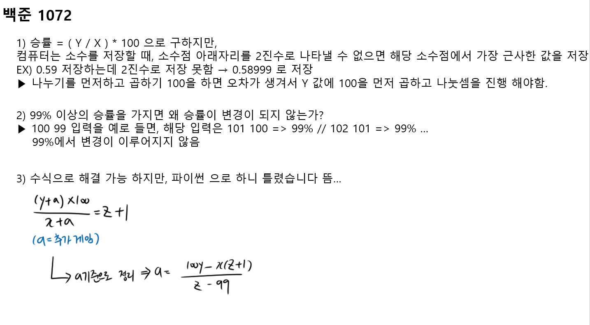

 

- 백준 - 개똥벌래(3020)

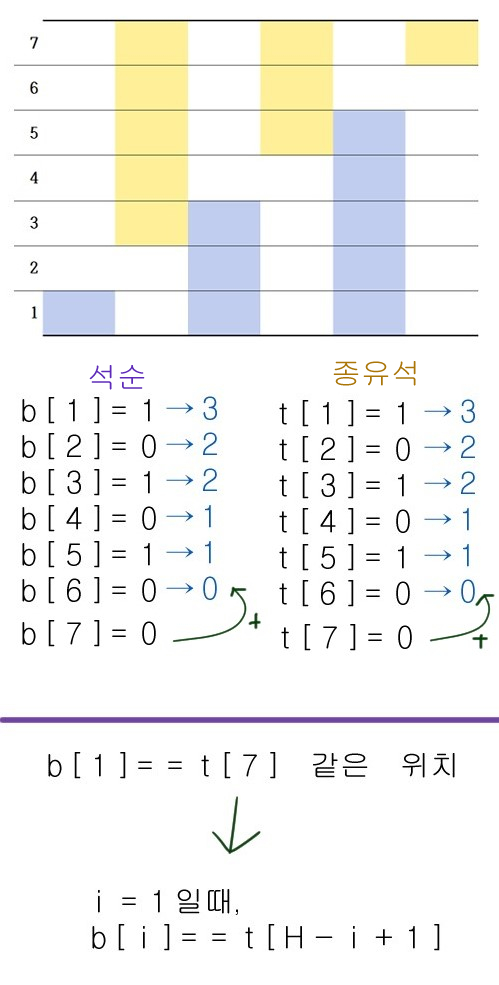

 

 

 

### 2021.10.13

- 백준 - 용액(2470) 

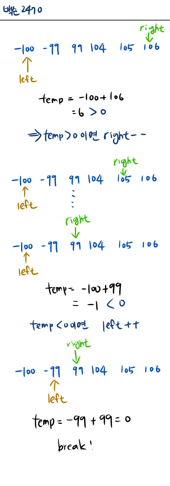

 

 

 

### 2021.10.27

- 백준 - 부등호(2529)

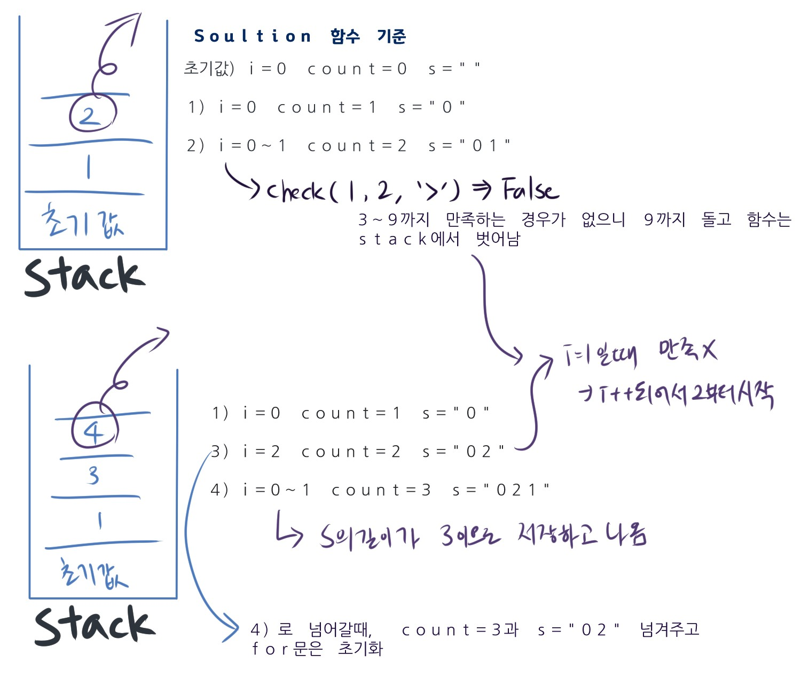

 

 

 

### 2022.01.19

- 프로그래머스 - N으로 표현하기 (Level 3)

  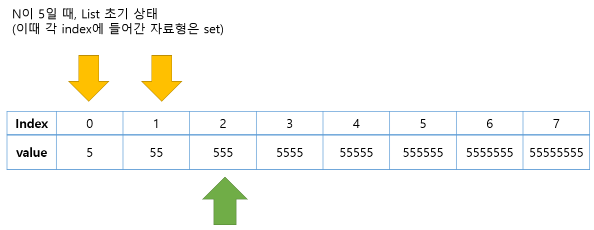

​		⑴ 초기 list의 요소(set)에 string=int(N*(index+1))를 넣음

​		⑵ N의 최대값은 9이지만, 최솟값이 8보다 크면 -1을 return 하기 때문에 list의 크기는 7까지만(0부터 시작하니 7까지 가면 딱 8개)

​		⑶ 4중 for문 하나씩 뜯어보자

​			▶ 첫번째 for문 x: 전체 N을 순회하는 아이로 1 ~ 7로 고정 값

​			▶ 두번째 for문 y : 0 ~ x까지

​			▶ 세번째 for문 z : index==y에 있는 set 순회

​			▶ 네번째 for문 w : 0 ~ y까지 set 순회 해서 index==x set에 넣어줌

​		⑷ 사칙연산에서 3 = 2 + 1 // 3 = 1 + 2 => 다른 연산으로 취급됨

 

 

 

### 2022.02.03

- 프로그래머스 - [거리두기 확인](https://programmers.co.kr/learn/courses/30/lessons/81302)

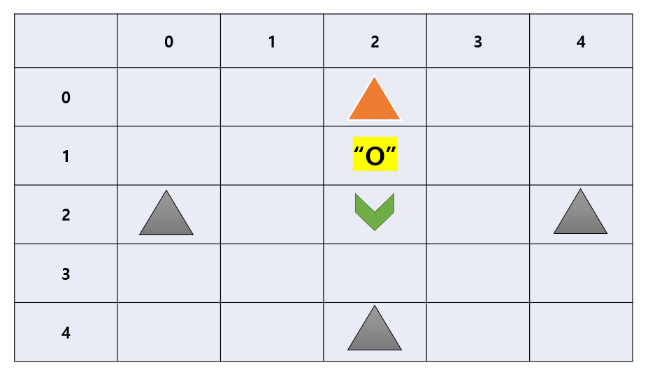

​	⑴ 맨해튼 거리가 1일때, 상하좌우를 확인해서 "P"가 있으면 실패

​	⑵ 만약, 맨해튼 거리가 1일때, 상화좌우에 그림과 같이 "O"가 있다면?

​		→ "O" 기준으로 상하좌우를 봐서 "P"가 없으면 통과

​		→ 검사할때 맨해튼 거리가 2를 초과한 곳이라면 뭐가 있든 거리두기를 지키고 있기 때문에 넘어감

 

 

 

### 2022.02.23

- 백준 - [알약](https://www.acmicpc.net/problem/4811)

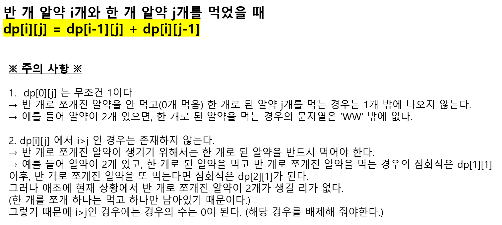

 

 

 

### 2022.03.09

- 백준 - [선수과목](https://www.acmicpc.net/problem/14567)

  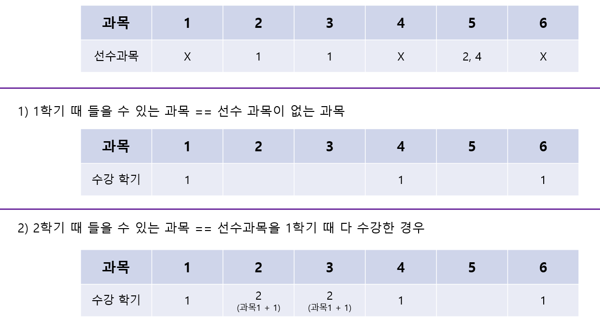

  

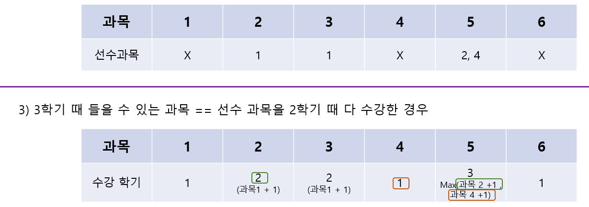

 

 

 

### 2022.05.25

- 프로그래머스 - [양궁대회](https://programmers.co.kr/learn/courses/30/lessons/92342)

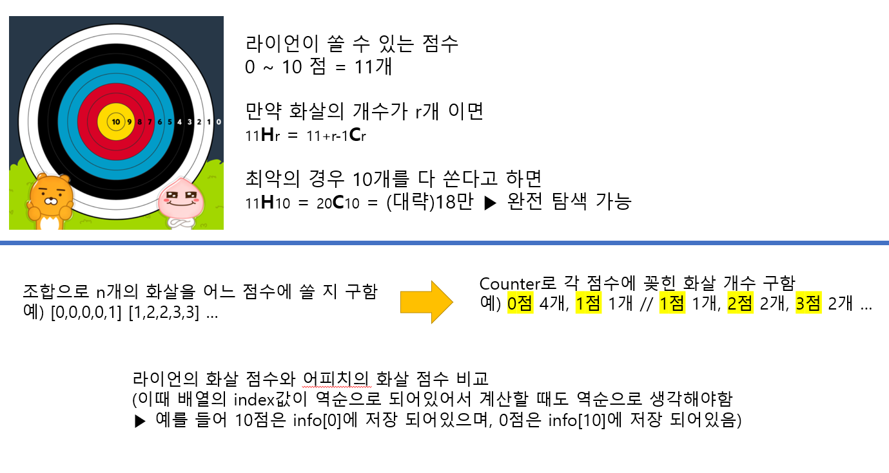

 

 

 

### 2022.06.08

- 프로그래머스 - [숫자 블록]https://programmers.co.kr/learn/courses/30/lessons/12923)

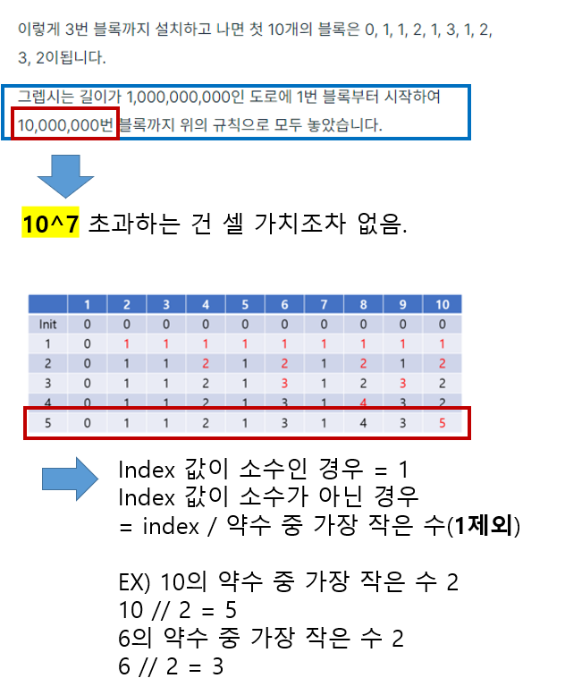

 

 

 

### 2022.06.15

- 프로그래머스 - [3Xn 타일링](https://programmers.co.kr/learn/courses/30/lessons/12902)
  - 백준 - [2133](https://www.acmicpc.net/problem/2133)

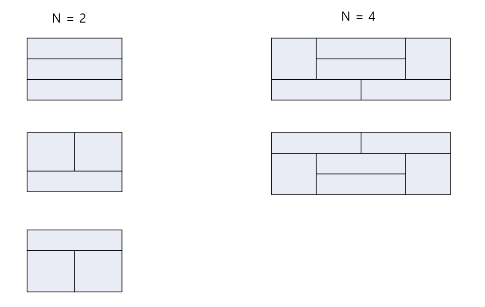

⑴ N이 짝수 일 때만 가능

⑵ N = 2일 때, 3가지 경우가 나오므로, N=4 일땐 3*3 이 됨

⑶ 근데, 4일 때 부터 특수 케이스가 생김. 각 숫자일 때만 나오는 타일 배치가 생김 ▶ 2개씩 생김

⑷ 특수 케이스인 2개에 나머지 공간을 채워야함. 나머지 공간를 채울 수 있는 개수? ▶ dp[i]=dp[i-j]*2

​		- i가 6이고, j가 4이면 ▶ dp[6]=dp[2]*2(4일 때 나오는 특수 경우로 4칸 채우고, 나머지는 2칸을 채우는 방식 선택)

